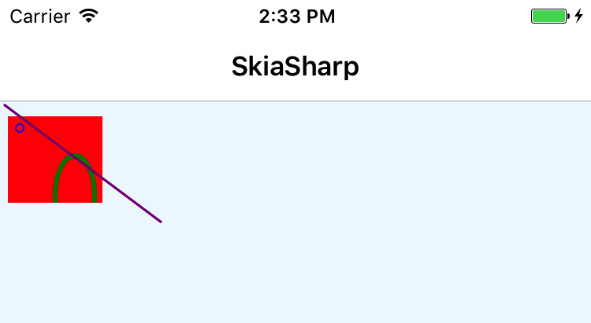

# SkiaSharpGraphics

This is something that I am playing around with to see if there was a way to do all 
SkiaSharp drawing using a markup language, such as XAML. This will allow for some 
cool things that could happen later on.

All of this was inspired by this forum post: https://forums.xamarin.com/discussion/96474/nativeelement. Feel free to comment on this post and chat with the OP.

Right now I have a very rough bit of code, but it has the start of something bigger.
Take, for example, this chunk of Xamarin.Forms XAML:

```xml
<Grid>
    <g:GraphicsCanvas>
        <g:Rectangle Top="20" Left="10" Width="120" Height="110" 
                     FillColor="Red" ClipChildren="true">
            <g:Oval Top="10" Left="10" Width="10" Height="10" 
                    StrokeColor="Blue" StrokeWidth="2" />
            <g:Oval Top="50" Left="60" Width="50" Height="100" 
                    StrokeColor="Green" StrokeWidth="6" />
        </g:Rectangle>
        <g:Line Top="5" Left="5" Width="200" Height="150"
                StrokeColor="Purple" StrokeWidth="3" />
    </g:GraphicsCanvas>
</Grid>
```

It can produce an image:



This is way cooler and less work than having to write out a big chunk of C# code.

Right now I have a very crude engine, but can be improved. It supports:

 - shapes - rectangles, ovals, circles, and lines
 - clipping
 - stroke width and color
 - fill color
